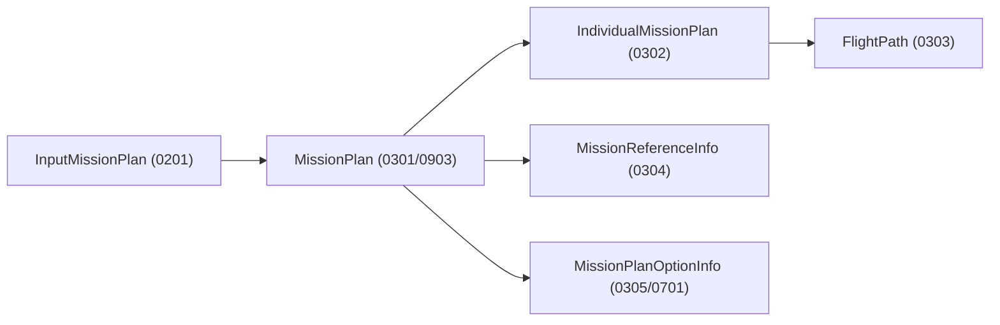

# Mission Planning ID와 JSON 스키마 관계

마지막 재정리: 2026-05-04

Mission Planning 산출물은 여러 JSON 파일이 ID로 연결된 구조다. 재계획 기능을 수정할 때 가장 많이 생기는 오류는 ID 충돌, 기존 파일 덮어쓰기, MissionPlan과 FlightPath의 관계 불일치다.

## 산출물 관계

기본 관계는 다음과 같다.

`MissionPlan`은 전체 계획의 루트다. `IndividualMissionPlan`은 항공기/개별 임무 단위의 계획이고, `FlightPath`는 실제 waypoint/path 세부 정보다. `InputMissionPlan`은 원본 입력 또는 재계획을 위해 변형된 입력 묶음이다.

## 일반 ID allocator

`modules/mission_planning/MissionPlanner/data_def/id_allocator.py`가 일반 계획 ID를 관리한다.

현재 기준 주요 base는 다음과 같다.

| ID 종류 | 시작 기준 |
| --- | --- |
| `missionPlanID` | `700000001` |
| `individualMissionPackageID` | `800000001` |
| `individualMissionID` | `900000001` |
| `pathID` | `aircraftID * 100000000 + 1` 계열 |
| `waypointID` | `50`부터 volatile 관리 |

waypoint ID는 단순 증가만 하지 않는다. `DSS_Internal/waypoint_usage.json`과 기존 `FlightPath` 파일을 스캔해 충돌을 피한다. 따라서 재계획 파이프라인이 직접 waypoint ID를 만들 때는 allocator를 우회하지 않는다.

## 0202/선행 계열 ID allocator

`modules/mission_planning/MissionPlanner/data_def/id_allocator_0202.py`는 0202/선행 계열 임무 ID를 별도로 관리한다. 현재 `_BASE_STATE["individualMissionID"]`가 `950000000`이고 다음 값은 `950000001`부터 나온다. path/waypoint는 일반 allocator와 이어져 충돌을 피해야 한다.

## 경로 ID와 항공기

FlightPath는 항공기별 path ID 충돌에 민감하다. 기본 path ID는 항공기 ID 기반 block에서 시작하며, `aircraft_parallel_0303.py`는 항공기별로 0303을 병렬 생성하면서 waypoint block과 path ID 동기화를 맞춘다.

재계획 파이프라인이 기존 경로 일부를 자르고 새 경로를 붙이는 경우에는 다음을 확인한다.

- 기존 path ID를 유지할지 새 path ID를 발급할지
- 새 waypoint ID가 기존 FlightPath와 충돌하지 않는지
- `IndividualMissionPlan`이 새 FlightPath ID를 참조하는지
- `MissionPlan`의 path/mission/package 참조가 최신 파일과 일치하는지

## plan lineage

재계획은 현재 계획과 원본 계획을 구분해야 한다. 코드에서 자주 쓰는 필드는 다음과 같다.

| 필드 | 의미 |
| --- | --- |
| `missionPlanID` | 새로 만들거나 참조하는 계획 ID |
| `currentMissionPlanID` | Monitoring/Simulation에서 현재 적용 중인 계획 |
| `sourceMissionPlanID` | 재계획의 기준이 되는 원본/부모 계획 |
| `missionPlanIDList` | 후보 또는 관련 계획 목록 |
| `inputMissionIDList` | 재계획 대상 입력 임무 목록 |
| `replanDetail.missionPlanID` | 상세 저장소 또는 트리거가 가리키는 계획 |

공격/선행/합류 계열은 lineage가 특히 중요하다. `attack_tracking_state.resolve_plan_lineage_ids` 같은 helper가 current/source 관계를 복원한다.

## 0902 스키마에서 ID가 들어오는 곳

`0902`에서 Mission Planning이 계획 ID를 수집하는 위치는 여러 곳이다.

- `optionList[].missionPlanID`
- `pendingOptionList[].missionPlanID`
- `missionPlanIDList`
- `replanDetail.missionPlanID`
- `replanDetail.currentMissionPlanID`
- `replanDetail.currentPlanID`
- `replanDetail.sourceMissionPlanID`

하나만 보고 판단하면 누락이 생긴다. 예를 들어 Monitoring 큐가 옵션 후보를 합치거나 target detection을 지연 dispatch하는 경우 `pendingOptionList`와 상세 저장소가 더 정확할 수 있다.

## 파일명과 내부 ID

대부분의 산출물은 파일명에 ID가 들어간다. 하지만 파일명과 JSON 내부 ID가 항상 자동으로 검증되는 것은 아니다. 문서/테스트/로그 분석에서는 다음을 같이 확인한다.

- 파일명 ID
- JSON root의 ID
- MissionPlan에서 참조하는 하위 ID
- 하위 파일 내부의 ID
- `MissionPlanOptionInfo`의 추천/옵션 ID

파일명만 맞고 내부 ID가 틀리면 시뮬레이터 로드는 실패하거나 엉뚱한 경로를 로드할 수 있다.

## 대체 waypoint

경로 이탈 파이프라인은 대체 waypoint를 삽입하거나 제거한 waypoint ID를 result에 담는다. Monitoring 쪽 `path_deviation_replan.py`는 합성 대체 waypoint ID가 다시 경로이탈 트리거를 만드는 자기 재계획 체인을 막는 guard를 갖고 있다.

따라서 대체 waypoint 관련 코드를 수정할 때는 다음을 지킨다.

- 합성 waypoint ID 범위를 기존 waypoint와 충돌시키지 않는다.
- 대체 waypoint를 향한 움직임은 경로 이탈 판정에서 예외 처리한다.
- 제거/삽입 waypoint ID는 result/log에 남긴다.
- 새 FlightPath와 현재 0401 상태의 next waypoint 해석이 맞는지 확인한다.

## 입력 임무 타입

재계획 fallback은 `inputMissionType`이 누락되거나 0인 입력을 geometry 기반으로 추론한다. 타입 1/7은 라인 폭 보정 대상이며, formation-flight 성격의 입력은 다음 협업 파이프라인에서 별도 skip 조건을 갖는다.

정찰 특화 파이프라인은 option code `4`를 기준으로 동작한다. 고정 FOV, sweep separation scale, split width 같은 값이 일반 계획과 다르므로, option code를 변경할 때는 `recon_specialized_pipeline.py`와 GUI의 option mapping을 같이 확인한다.

## 검증 체크

ID/스키마 변경 후 최소 확인 항목은 다음과 같다.

1. 새 `MissionPlan` 파일이 존재하고 내부 `missionPlanID`가 파일명과 일치한다.
2. 참조하는 `InputMissionPlan`, `IndividualMissionPlan`, `FlightPath`, `MissionReferenceInfo` 파일이 모두 존재한다.
3. waypoint ID가 기존 파일과 충돌하지 않는다.
4. `MissionPlanOptionInfo`가 실제 생성된 계획 ID를 가리킨다.
5. `0903` payload의 계획 ID와 파일 산출물이 일치한다.
6. 시뮬레이터 `plan_load`가 같은 계획을 읽을 수 있다.
