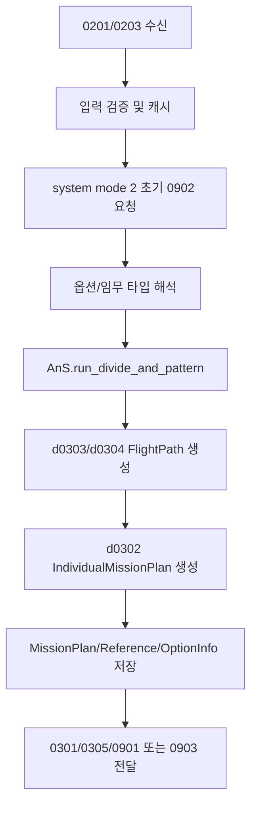

# 최초 계획 생성 파이프라인

마지막 재정리: 2026-05-04

최초 계획 생성은 재계획보다 단순해 보이지만, 현재 런타임에서는 Monitoring이 system mode `2` 전환 시 `0902` 형식의 초기임무재계획 요청을 만들어 Mission Planning으로 넣는 흐름을 탄다. 내부 계획 생성은 입력 정규화, 옵션별 분할, FOV/속도/폭 보정, 산출물 ID 할당, 0301~0305 전달까지 포함한다. 재계획 fallback도 이 경로를 재사용하므로 최초 계획 흐름을 이해해야 전용 재계획의 차이를 볼 수 있다.

## 입력

주요 입력은 다음과 같다.

| 입력 | 역할 |
| --- | --- |
| `0201` | 입력 임무 계획, 임무 geometry, 임무 타입, 임무 ID |
| `0203` | 임무 조건/제약/운용 모드 계열 입력 |
| `0902` 초기임무재계획 | Monitoring system mode 2에서 생성되는 초기 계획 요청 |
| GUI 설정 | 항공기 수, 속도, FOV, split/spacing, option 선택 |
| 활성 DB | 기존 계획/경로/참조 파일과 ID 상태 |

`0201`은 파일과 메시지 모두에서 들어올 수 있다. Mission Planning GUI는 최신 입력을 캐시하고, 재계획 시에는 원본을 그대로 쓰지 않고 필터링/override한 변형 입력을 만들 수 있다.

## 기본 처리 흐름

일반 계획의 핵심은 `AnS.run_divide_and_pattern()`에서 `planning_enhanced`로 위임되는 divide-and-pattern 계열 로직이다. 입력 임무를 항공기/영역/라인 단위로 나누고, 임무 타입과 옵션에 맞춰 개별 mission과 flight path를 만든다.

## 입력 정규화

최초 계획과 재계획 fallback 모두 다음과 같은 입력 정규화가 중요하다.

- geometry가 비어 있는 임무 제외 또는 실패 처리
- 단일 좌표만 있는 임무의 유효성 확인
- `inputMissionType` 누락/0일 때 타입 추론
- line/area/formation 계열별 폭과 sweep 간격 보정
- 완료/비활성 임무 제외
- option code에 따른 파이프라인 선택

현재 코드는 재계획에서 더 공격적으로 입력을 정리한다. 최초 계획에서 통과한 입력도 재계획에서는 완료 상태나 잔여 영역 snapshot 때문에 제외될 수 있다.

## 정찰 특화 옵션

`modules/mission_planning/pipelines/recon_specialized_pipeline.py`는 option code `4`를 정찰 특화 후보로 다룬다.

현재 주요 기본값은 다음과 같다.

| 항목 | 값 |
| --- | --- |
| option code | `4` |
| 기본 split width | `600m` |
| 고정 FOV | `15deg` |
| sweep separation scale | `0.50` |

정찰 특화 후보는 GUI runtime payload의 값을 수정해 일반 분할 계획과 다른 패턴을 만든다. manual FOV sync가 켜진 경우에는 해당 설정을 존중한다.

## 0303 병렬 생성

`modules/mission_planning/runtime/aircraft_parallel_0303.py`는 항공기별 0303 생성 병렬화를 담당한다. 경로 생성을 병렬화할 때도 waypoint ID와 path ID가 충돌하지 않도록 block 단위로 동기화한다.

관련 환경 변수는 다음과 같다.

| 환경 변수 | 의미 |
| --- | --- |
| `REPLAN_VARIANT_PARALLEL` | 옵션 후보 병렬 실행 |
| `REPLAN_VARIANT_WORKERS` | 후보 워커 수 |
| `REPLAN_VARIANT_WAYPOINT_BLOCK_SIZE` | waypoint block 크기 |
| `REPLAN_RECON_WORKER_CAP` | 정찰 후보 워커 상한 |

환경 변수 이름에 `REPLAN`이 들어가지만 일반 후보 생성 성능에도 영향을 줄 수 있다.

## 산출물

최초 계획에서 생성되는 대표 산출물은 다음과 같다.

| 산출물 | 위치 |
| --- | --- |
| MissionPlan | `MissionPlan/<missionPlanID>.json` |
| InputMissionPlan | `InputMissionPlan/<inputMissionPlanID>.json` |
| IndividualMissionPlan | `IndividualMissionPlan/<packageID 또는 missionID>.json` |
| FlightPath | `FlightPath/<pathID>.json` |
| MissionReferenceInfo | `MissionReferenceInfo/<id>.json` |
| MissionPlanOptionInfo | `MissionPlanOptionInfo/<id>.json` |
| 내부 로그 | `DSS_Internal/*` |

파일명 규칙은 파이프라인마다 조금 다를 수 있으므로, 실제 분석은 `MissionPlan` 내부 참조를 기준으로 따라가는 것이 안전하다.

## 메시지 출력

초기 계획은 보통 다음 흐름을 가진다.

1. Monitoring이 system mode `2`에서 초기 `0902` 요청 생성
2. Mission Planning이 계획 생성 완료
3. `0301`로 missionPlanID 참조 전달
4. `0305 status=2` 완료/옵션 정보 전달
5. 필요 시 `0901` option request 또는 `0903` direct apply 전달
6. Monitoring/Simulation이 active DB에서 계획 상세를 읽어 표시하거나 로드

`0301` payload는 전체 계획 JSON이 아니라 보통 `{timestamp, source, missionPlanID}` 형태의 참조다. downstream은 active DB의 `MissionPlan/<id>.json`과 하위 파일을 읽어야 한다.

## 재계획 fallback과의 관계

일반 재계획 fallback은 최초 계획 파이프라인을 거의 그대로 재사용하지만, 입력 준비 단계가 다르다.

재계획 fallback에서 추가되는 작업은 다음과 같다.

- 현재 진행 상황 기반 mission area snapshot 적용
- 완료 임무 제거
- 현재 임무 잔여 구간 하이브리드 입력 생성
- 전용 파이프라인이 처리하지 않은 후보만 일반 후보로 전달
- `DSS_Internal/replan_inputs`에 override source 저장
- 결과에 current/source plan lineage 기록

따라서 최초 계획 기능을 수정하면 일반 재계획 fallback도 영향을 받을 수 있다.

## 흔한 실패 지점

최초 계획 생성에서 많이 틀리는 지점은 다음과 같다.

- `0201` geometry 좌표계나 필드명이 예상과 다름
- `inputMissionType`이 0이거나 누락되어 의도와 다른 타입으로 추론됨
- option code와 GUI 표시 옵션명이 어긋남
- waypoint/path ID가 기존 파일과 충돌함
- 0301은 생성됐지만 0305 추천 정보가 실제 계획 ID를 가리키지 않음
- 활성 DB 루트가 GUI/시뮬레이터에서 서로 다름

문제 재현 시에는 입력 원본, 정규화 후 입력, 최종 MissionPlan, 첫 번째 FlightPath를 함께 비교한다.
