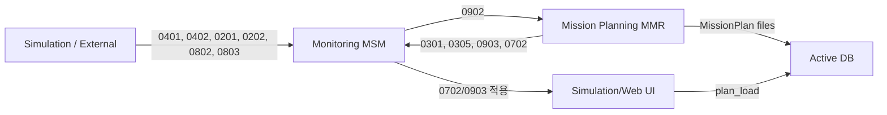

# 메시지와 파일 인터페이스

마지막 재정리: 2026-05-04

Mission Planning, Monitoring, Simulation은 nFusion 메시지, HTTP API, 파일 기반 DB를 함께 사용한다. 재계획 기능을 분석할 때 이 세 경계를 섞어 설명하면 원인을 놓치기 쉽다.

## 전체 흐름

웹 UI가 Mission Planning 파이프라인을 직접 호출하지 않는다. 재계획 자체는 Monitoring의 `0902`, Mission Planning의 DB 산출물, 다시 돌아오는 `0903`/`0702` 적용 흐름으로 진행된다.

## 메시지 ID 요약

| 메시지 | 방향 | 역할 |
| --- | --- | --- |
| `0101` | external -> modules | system mode, scenario activation |
| `0201` | external/sim -> MMR/MSM | input mission plan |
| `0202` | external/sim -> MSM | prior mission input |
| `0203` | external/sim -> MMR | mission condition/constraint |
| `0301` | MMR -> MSM/sim | mission plan |
| `0302` | file | individual mission plan |
| `0303` | file | flight path |
| `0304` | file | mission reference info |
| `0305` | MMR -> MSM/UI | mission plan option/status |
| `0401` | sim/external -> MSM | agent state |
| `0402` | sim/external -> MSM | target detection/destroyed |
| `0501` | MSM -> external | monitoring state periodic |
| `0502` | MSM -> external | mission end request |
| `0503` | MSM -> UI/external | mission recommendation |
| `0504` | MSM -> external | fuel/status warning |
| `0701` | UI/MMR -> MSM | option info/request |
| `0702` | UI/MMR -> MSM/sim | option decision/apply |
| `0802` | UI/external -> MSM | forced command |
| `0803` | web/UI -> MSM/sim | execute next/reexecute |
| `0901` | MMR/UI | mission planning request 계열 |
| `0902` | MSM -> MMR | replan request |
| `0903` | MMR -> MSM/sim | replan result direct update |
| `0904` | external/sample | mission planning 관련 확장 샘플 |
| `0001` | modules -> UI/MSM | failure/no-op/notice |

`0302`, `0303`, `0304`는 메시지처럼 명명되지만 실제 운용에서는 파일 산출물로 읽히는 비중이 크다.

## 0902 payload

재계획 요청의 핵심 필드는 다음과 같다.

| 필드 | 의미 |
| --- | --- |
| `timestamp` | 요청 시각 |
| `source` | 보통 `MSM` |
| `replanRequestTime.replanRequestTimestamp` | 재계획 요청 시각 |
| `replanLevel` | 재계획 우선/종류 레벨 |
| `reason` | 사람이 읽는 재계획 사유 |
| `inputMissionIDList` | 대상 입력 임무 ID |
| `missionPlanIDList` | 관련/후보 mission plan ID |
| `optionList` | 후보 옵션 |
| `pendingOptionList` | 대기 후보 옵션 |
| `replanRequest` | 요청 본문 |
| `replanDetail` | trigger별 상세 |

nFusion 스키마에 없는 확장 필드는 직접 메시지 변환 중 손실될 수 있으므로 `modules/common/replan_request_transport_store.py`가 sidecar를 남긴다. 수신 쪽 `receive_center.py`는 `0902` 수신 시 sidecar를 병합해 `replanDetail` 손실을 보완한다.

sidecar 위치:

- `%ACTIVE_DB_ROOT%/DSS_Internal/replan_request_transport/replan_request_<timestamp>.json`
- fallback archive: `%ACTIVE_DB_ROOT%/DSS_Internal/replan_request_archive`

## 0305와 0701/0702

`0305`는 옵션 정보와 계획 상태를 전달한다. 현재 MMR 송신 기준 `missionPlanningStatus`는 `1=수행 중`, `2=완료` 흐름을 사용한다. 일부 과거 주석이나 대시보드 처리는 `0/1` 관성을 가질 수 있으므로 로그 해석 시 실제 payload 값을 먼저 본다.

`0701`은 옵션 정보/요청 흐름이다. 현재 큐 설정의 `release_on_option_info=false` 때문에 `0701`만으로 active 재계획이 완료되지는 않는다.

`0702`는 선택/적용 응답이다.

| 값 | 의미 |
| --- | --- |
| `ignore=1` | 현재 plan 유지 또는 적용 거부 |
| `ignore=2` | 선택 plan 적용 |

웹 옵션 팝업은 사용자가 옵션을 선택하면 `0702 ignore=2 missionPlanID=...`를 보내고 `/api/mission/plan_load`로 시뮬레이터에 해당 MissionPlan을 로드한다.

## 0903 직접 갱신

`0903`은 Mission Planning이 새 계획을 직접 적용하라고 보내는 메시지다. 다음 파이프라인에서 자주 쓰인다.

- post-attack rejoin
- next collab
- imaging schedule
- quality speed
- path deviation
- prior mission
- prior-post-rejoin

일부 직접 갱신은 `0701`/옵션 선택 없이 `0301 + 0903`으로 끝날 수 있다. 이 경우 옵션 팝업이 뜨지 않는 것이 정상일 수 있다.

## 활성 DB 파일

`%ACTIVE_DB_ROOT%`는 현재 시나리오 DB 루트다. `run.py`는 `0101 SystemMode=1` 진입 시 `current_scenario.json`을 갱신하고 각 모듈 프로세스에 `KU_MISSION_DB_ROOT`를 전달한다.

대표 디렉터리:

| 디렉터리 | 내용 |
| --- | --- |
| `InputMissionPlan` | 0201 입력/변형 입력 |
| `MissionPlan` | 0301/0903 전체 계획 |
| `IndividualMissionPlan` | 0302 개별 계획 |
| `FlightPath` | 0303 경로 |
| `MissionReferenceInfo` | 0304 참조 정보 |
| `MissionPlanOptionInfo` | 0305/0701 옵션 정보 |
| `VehicleStatus` | 시뮬레이터 상태 |
| `mission_output` | 일부 호환 출력 |
| `DSS_Internal` | 내부 상태/로그/재계획 상세 |

루트 `Logs/DSS_Internal`가 아니라 각 시나리오의 `%ACTIVE_DB_ROOT%/DSS_Internal`가 실제 산출물 위치다.

## 공통 push/receive 계층

| 파일 | 역할 |
| --- | --- |
| `modules/common/push_center.py` | 메시지 ID별 push module을 동적으로 찾아 `make_and_push` 또는 generator 호출 |
| `modules/common/push_type_cache.py` | Python module/C# nFusion type 캐시 |
| `modules/common/receive_center.py` | 탭의 `mark_received`와 일반 callable listener 통합 dispatch |
| `modules/common/make_message_receiver.py` | 메시지 수신기 생성 |
| `modules/common/make_message_push.py` | 메시지 push helper |

메시지가 실제로 나갔는지 볼 때는 GUI 함수만 보지 말고 push center와 integration log까지 확인한다.

## 웹/시뮬레이터 API

대표 HTTP API:

| API | 역할 |
| --- | --- |
| `/api/integration/state` | integration 상태 |
| `/api/integration/payload` | 특정 msgId payload 조회 |
| `/api/integration/send_custom` | 웹에서 0803/0702 등 custom 송신 |
| `/api/sim/state` | 시뮬레이터 상태 |
| `/api/sim/mission` | 현재 mission 상태 |
| `/api/sim/play`, `/pause`, `/stop`, `/reset` | 시뮬레이터 제어 |
| `/api/sim/next_mission` | 다음 임무 진행 |
| `/api/sim/force_command` | 강제 명령 |
| `/api/mission/load` | 임무 파일 로드 |
| `/api/mission/plan_load` | `missionPlanID`로 DB 계획 로드 |
| `/api/monitoring/state` | Monitoring snapshot |
| `/tiles`, `/dem` | 지도/고도 데이터 |

`mission_recommend_popup.js`는 `0503`을 polling하고, "다음"은 `0803 execute=1`, "재수행"은 `0803 execute=2`를 보낸다. `mission_option_popup.js`는 `0701/0702/0903`을 polling하고 선택 시 `0702 ignore=2`와 `plan_load`를 실행한다.

## 시뮬레이터 plan load

`modules/sim/mission/mission_plan_loader.py`는 `MissionPlan/<id>.json`을 기준으로 연결된 `InputMissionPlan`, `IndividualMissionPlan`, `FlightPath`, `MissionReferenceInfo`를 읽어 시뮬레이터 payload를 만든다.

따라서 Mission Planning이 `0903`을 보냈더라도, DB 파일 관계가 깨져 있으면 시뮬레이터 적용이 실패한다. 이 경우 메시지 로그에는 갱신이 보이지만 지도/차량 경로는 변하지 않을 수 있다.

## 샘플 메시지

nFusion 메시지 샘플은 `resource/nFusion 파일_0316` 아래에 있다. 내부 핵심 메시지는 `0201/0202/0203`, `0301/0305`, `0401/0402`, `0501/0502/0503`, `0701/0702`, `0802/0803`, `0901/0902/0903/0904`이고, 시뮬레이터/외부 연계 샘플은 `513xx`, `531xx` 계열도 포함한다.

문서화할 때는 깨진 한글 라벨보다 메시지 ID, trigger type, plan ID, source tag를 기준으로 설명하는 편이 안전하다.
